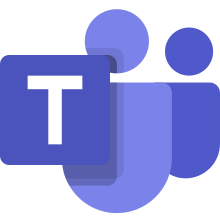

<p align="left">
  
</p>

# Vexa — Real-Time Meeting Transcription API

<p align="left">
  
  <strong>Google Meet</strong>
    
  
  <strong>Microsoft Teams</strong>
</p>

[](LICENSE)
[](https://discord.gg/Ga9duGkVz9)

## 🎉  What's new in v0.6 (4 Oct 2025)

- **Microsoft Teams support** (alongside Google Meet)
- **WebSocket transcripts streaming** for efficient sub-second delivery
- Numerous reliability and joining improvements from real-world usage of our hosted service

**Vexa** drops a bot into your online meeting and streams transcripts to your apps in real time.

- **Platforms:** Google Meet **and Microsoft Teams**
- **Transport:** REST **or WebSocket (sub-second)**
- **Run it your way:** Open source & self-hostable, or use the hosted API.

👉 **Hosted (start in 5 minutes):** https://vexa.ai

👉 **Self-host guide:** [docs/deployment.md](docs/deployment.md)

---

> See full release notes: https://github.com/Vexa-ai/vexa/releases

---

## Quickstart

- Hosted (fastest): Get your API key at [https://vexa.ai/dashboard/api-keys](https://vexa.ai/dashboard/api-keys)

Or self-host the entire stack:

Self-host with Docker Compose:

```bash
git clone https://github.com/Vexa-ai/vexa.git
cd vexa
make all            # CPU by default (Whisper tiny) — good for development
# For GPU:
# make all TARGET=gpu    # (Whisper medium) — recommended for production quality
```

* Full guide: [docs/deployment.md](docs/deployment.md)
* For self-hosted API key: follow `vexa/nbs/0_basic_test.ipynb`

## 1. Send bot to meeting:

`API_HOST` for hosted version is `https://api.cloud.vexa.ai `
`API_HOST` for self-hosted version (default) is `http://localhost:18056`

### Request a bot for Microsoft Teams

```bash
curl -X POST https://<API_HOST>/bots \
  -H "Content-Type: application/json" \
  -H "X-API-Key: <API_KEY>" \
  -d '{
    "platform": "teams",
    "native_meeting_id": "<NUMERIC_MEETING_ID>",
    "passcode": "<MEETING_PASSCODE>"
  }'
```

### Or request a bot for Google Meet

```bash
curl -X POST https://<API_HOST>/bots \
  -H "Content-Type: application/json" \
  -H "X-API-Key: <API_KEY>" \
  -d '{
    "platform": "google_meet",
    "native_meeting_id": "<MEET_CODE_XXX-XXXX-XXX>"
  }'
```

## 2. Get transcripts:

### Get transcripts over REST

```bash
curl -H "X-API-Key: <API_KEY>" \
  "https://<API_HOST>/transcripts/<platform>/<native_meeting_id>"
```

For real-time streaming (sub‑second), see the [WebSocket guide](docs/websocket.md).
For full REST details, see the [User API Guide](docs/user_api_guide.md).

Note: Meeting IDs are user-provided (Google Meet code like `xxx-xxxx-xxx` or Teams numeric ID and passcode). Vexa does not generate meeting IDs.

---

## Who Vexa is for

* **Enterprises (self-host):** Data sovereignty and control on your infra
* **Teams using hosted API:** Fastest path from meeting to transcript
* **n8n/indie builders:** Low-code automations powered by real-time transcripts
  - Tutorial: https://vexa.ai/blog/google-meet-transcription-n8n-workflow

---

## Roadmap

* Zoom support (public preview next)

> For issues and progress, join our [Discord](https://discord.gg/Ga9duGkVz9).

## Build on Top. In Hours, Not Months

**Build powerful meeting assistants (like Otter.ai, Fireflies.ai, Fathom) for your startup, internal use, or custom integrations.**

The Vexa API provides powerful abstractions and a clear separation of concerns, enabling you to build sophisticated applications on top with a safe and enjoyable coding experience.

<p align="center">
  
</p>

- [api-gateway](./services/api-gateway): Routes API requests to appropriate services
- [mcp](./services/mcp): Provides MCP-capable agents with Vexa as a toolkit
- [bot-manager](./services/bot-manager): Handles bot lifecycle management
- [vexa-bot](./services/vexa-bot): The bot that joins meetings and captures audio
- [WhisperLive](./services/WhisperLive): Real-time audio transcription service
- [transcription-collector](./services/transcription-collector): Processes and stores transcription segments
- [Database models](./libs/shared-models/shared_models/models.py): Data structures for storing meeting information

> 💫 If you're building with Vexa, we'd love your support! [Star our repo](https://github.com/Vexa-ai/vexa/stargazers) to help us reach 1500 stars.

### Features:

- **Real-time multilingual transcription** supporting **100 languages** with **Whisper**
- **Real-time translation** across all 100 supported languages

## Current Status

- **Public API**: Fully available with self-service API keys at [www.vexa.ai](https://www.vexa.ai/?utm_source=github&utm_medium=readme&utm_campaign=vexa_repo)
- **Google Meet Bot:** Fully operational bot for joining Google Meet calls
- **Teams Bot:** Supported in v0.6
- **Real-time Transcription:** Low-latency, multilingual transcription service is live
- **Real-time Translation:** Instant translation between 100 supported languages
- **WebSocket Streaming:** Sub-second transcript delivery via WebSocket API
- **Pending:** Speaker identification is under development

## Coming Next

- **Zoom Bot:** Integration for automated meeting attendance (July 2025)
- **Direct Streaming:** Ability to stream audio directly from web/mobile apps

## Self-Deployment

For **security-minded companies**, Vexa offers complete **self-deployment** options.

To run Vexa locally on your own infrastructure, the primary command you'll use after cloning the repository is `make all`. This command sets up the environment (CPU by default, or GPU if specified), builds all necessary Docker images, and starts the services.

**Deployment & Management Guides:**
- [Local Deployment and Testing Guide](docs/deployment.md)
- [Self-Hosted Management Guide](docs/self-hosted-management.md) - Managing users and API tokens

## Contributing

Contributors are welcome! Join our community and help shape Vexa's future. Here's how to get involved:

1. **Understand Our Direction**:
2. **Engage on Discord** ([Discord Community](https://discord.gg/Ga9duGkVz9)):

   * **Introduce Yourself**: Start by saying hello in the introductions channel.
   * **Stay Informed**: Check the Discord channel for known issues, feature requests, and ongoing discussions. Issues actively being discussed often have dedicated channels.
   * **Discuss Ideas**: Share your feature requests, report bugs, and participate in conversations about a specific issue you're interested in delivering.
   * **Get Assigned**: If you feel ready to contribute, discuss the issue you'd like to work on and ask to get assigned on Discord.
3. **Development Process**:

   * Browse available **tasks** (often linked from Discord discussions or the roadmap).
   * Request task assignment through Discord if not already assigned.
   * Submit **pull requests** for review.

- **Critical Tasks & Bounties**:
  - Selected **high-priority tasks** may be marked with **bounties**.
  - Bounties are sponsored by the **Vexa core team**.
  - Check task descriptions (often on the roadmap or Discord) for bounty details and requirements.

We look forward to your contributions!

## Contributing & License

We ❤️ contributions. Join our Discord and open issues/PRs.
Licensed under **Apache-2.0** — see [LICENSE](LICENSE).

## Project Links

- 🌐 [Vexa Website](https://vexa.ai)
- 💼 [LinkedIn](https://www.linkedin.com/company/vexa-ai/)
- 🐦 [X (@grankin_d)](https://x.com/grankin_d)
- 💬 [Discord Community](https://discord.gg/Ga9duGkVz9)

[](https://www.linkedin.com/in/dmitry-grankin/)

[](https://discord.gg/Ga9duGkVz9)

The Vexa name and logo are trademarks of **Vexa.ai Inc**.
